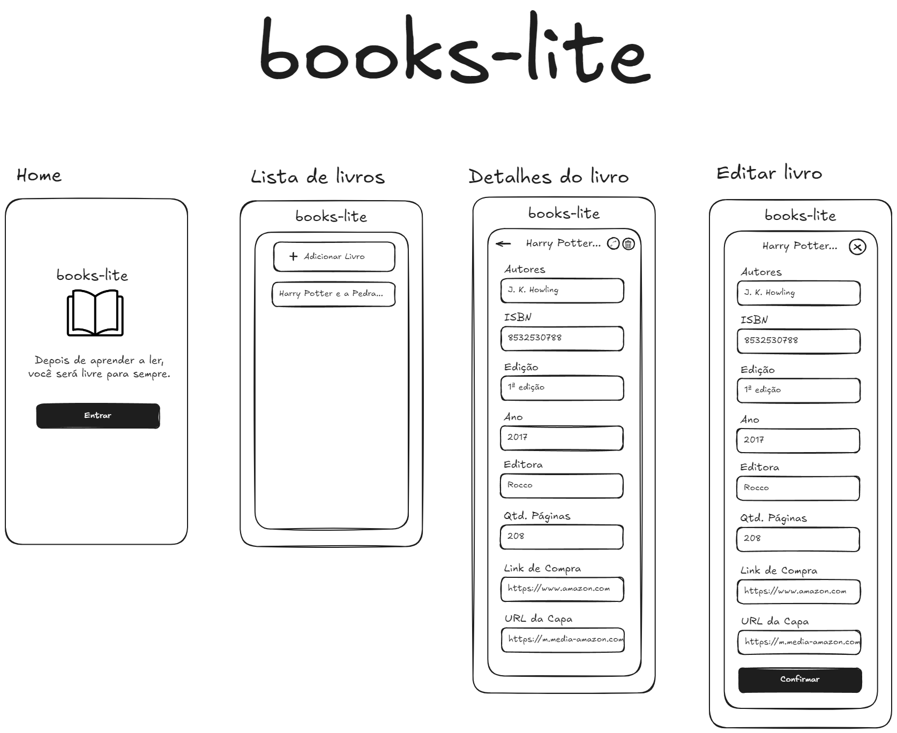

# BOOKS-LITE

Uma aplicação simples para cadastro e gerenciamento de livros, integrando frontend e backend. Este projeto foi desenvolvido para fins educacionais e demonstra o uso de tecnologias modernas para construção de aplicações web.



## Como Executar o Projeto

### Pré-requisitos
- Git instalado
- Node.js e npm ou pnpm instalados

### Clonando o Repositório
```bash
git clone git@github.com:luanmarcal/IFPR.git
```

### Configurando o Frontend
1. Navegue até o diretório do frontend:
    ```bash
    cd IFPR/semestre05/cai-augusto/frontend
    ```
2. Instale as dependências:
    ```bash
    npm install
    ```
    ou
    ```bash
    pnpm install
    ```
3. Execute o projeto:
    ```bash
    npm run dev
    ```
    ou
    ```bash
    pnpm dev
    ```
4. Acesse no navegador:
    Normalmente, o projeto estará disponível em `http://localhost:3000`.

### Configurando o Backend
1. Navegue até o diretório do backend:
    ```bash
    cd IFPR/semestre05/cai-augusto/backend
    ```
2. Instale as dependências:
    ```bash
    npm install
    ```
3. Execute o projeto:
    ```bash
    npm run dev
    ```

## Tecnologias Utilizadas
- **Frontend**: React, Vite
- **Backend**: Node.js, Express
- **Gerenciador de Pacotes**: npm ou pnpm